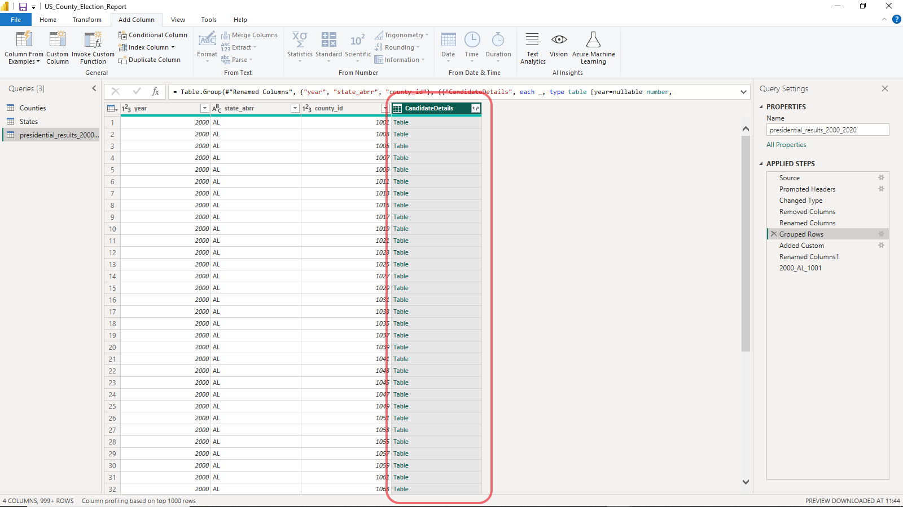

# Report 1 : US Presidential Elections 2002 TO 2020 - Dashboard

### Dashboard Link : https://github.com/kechcole/Power-BI-Reports/blob/main/US_Election_Report/US_County_Election_Report.pbix


## **Table of Contents**
1. [Problem Statement.](#1-problem-statement)
2. [Data Extraction.](#2-data-extraction)
3. [Load and Transform Data.](#3-load-and-transform-data)
4. [Data Modelling.](#4-data-modelling)
5. [Data Visualization.](#5-data-visualization)


## 1. Problem Statement
This dashboard aims at providing exceptional visual reporting of US presidential election results from 2000 to 2020 using Power BI. Well-curated visuals are carefully used to engage the readers effectively and enhance the report. Multiple tools were used to make people easily understand the outcome of elections clearly and concisely. Data is increasingly playing a big role in every part of an election cycle, either post-vote or before, underscoring the effects of robust data collection and analysis. Data munging provides critical insights that can be used to predict future trends and make critical decisions guiding strategy and efforts. This increased interdependency helps understand political behaviors, which drive campaign messaging, issues to be addressed, and even ideal locations to hold political rallies.


## 2. Data Extraction.

Free and [open source data](https://github.com/kechcole/Power-BI-Reports/tree/main/US_Election_Report/Data) was collected from multiple online sources. Non-spatial data was in CSV format, while spatial data was in shapefiles.
   
   a) [US Census Bureau](https://www.census.gov/)

   b) [US Department of agriculture](https://www.usda.gov/)

   Spatial data was simplified in [mapshaper](https://mapshaper.org/) and converted to topo-json format to make it compatible with Power BI.
## 3. Load and transform data.
   
Raw data is always dirty; it must be 'cleaned' before any analysis is done; otherwise, one is bound to encounter errors and generate incorrect reports. Issues identified in the data after loading include unnecessary columns, unfriendly naming conventions, and incorrect column data types. Using the Powerful Power query tool, inconsistencies and errors were removed to make the tables organized and intuitive.

Data transformation steps
Presidential results table               |   counties table   | states table
:-------------------:|:------------------:|:------------------:
||


   Presidential results table column quality after cleaning and transformation
   


         

## 4. Data Modelling.
   
A physical relationship between the three tables must be defined to allow manipulation operations such as filtering across multiple tables in our model. An active relationship was defined by dragging columns from one table to another containing the same values, ultimately linking them together. The presidential results table has a many-to-many relationship with counties model based on names but a many-to-one cardinality with states table linked through abbreviations columns.

Cardinality symbolized.


## 5. Data Visualization.
       
Election data visualized using various metrics turns granular data into understandable, visually compelling, and useful information. Hidden patterns are revealed by visually presenting information and connections; simply put, it 'brings data to life'. Insights within numbers are laid open through charts, graphs, interactive reports, and many more, laying the groundwork for making informed decisions quickly and effectively.

I am interested in the top two candidates for each state in the four elections. To achieve this, we need to aggregate presidential votes across counties, sort them, and select only the top two.


### 5.1 Aggregate Results With Partition Logic.
With Power Query, rows were summarized into a table and placed on a column named **CandidatesDetail** by grouping the values by year and state columns. This will allow for effective computation and generating summary information in the future when distilling models. Now to find the top two candidates, winner and runners-up, we simply sort the new table by candidate votes column and then filter the top two rows.

Partitioning.


The new *CandidatesDetail* column within the presidential results model contains summarized tables.


A formula that creates a second custom column containing tables with only the top 2 candidates

```
Table.MaxN([CandidateDetails],"candidatevotes",2)
```


A new table from the second custom column


Output table sample containing top 2 candidates in Arizona State for the year 2000. 


### 5.2 Merge Queries Determining Winner and Runner-Up.

Finding the top two candidates and placing them in their own column by filtering them from tables in our next goal. We will duplicate the previous query (complete with its steps) twice and then have a column containing the candidates we need. In the first duplicate, **winners**, the winner can easily be identified by changing *Top2Candidate* column formula to select only the top candidate and then expanding. 

```
Table.MaxN([CandidateDetails],"candidatevotes",1)
```
Winner table


Using a join operation between the winners table and **runner_up** table (second duplicate), the second runners-up name was filtered out. A merge query logic (left anti-join) returns rows in the right table (winners table) that have no matching records in the left table based on *candidate name* and *county id* columns (both must be selected in the merge pane). Contestants who came in second are in the right table but not in the winners model; thus, they were placed in the runner-up table.

Merge Query pane. 

Note that half of the records (19757) were selected because each county contains two candidates, but only the second one matches the join. 

Merge operation output containing runner-up candidates column


Finally, we need to synchronize the two queries so as to have important candidate information, both winners and runners-up in all counties, on a single sheet of paper. This avoids duplication of information and optimizes the performance of our model by reading data from a single source, the **merged_data** table.

A duplicate of the winner table was created, and all columns were removed except *county id, year* and *state abbreviation* columns. This was merged with the **runner_up** table to get first and second candidate data both in the same table using inner join operation where only row matching in both tables are retained. We now have winner and second placed candidates in one table but different columns. 

Merged data table


### 5.3 Visuals.


#### 5.3.1 Table.


#### 5.3.2 Card.
Multiple card visuals were designed to display key performance indicators that align with our goals and objectives. Card visuals use a single value to represent important metrics such as total votes, difference between winner and runner-up, and winner name. DAX functions were used to calculate metrics used in these cards.  

A card for displaying total votes cast each year needed new measure. 
```
Total Votes = CALCULATE(SUM(merged_data[VOTER TURN OUT]))
```

Various Card Visuals


#### 5.3.4 Pie Chart


#### 5.3.5 Choropleth Map.


#### 5.3.3 Q & A. 


#### 5.3.3 Slicer


## 5. Results.
The analysis results are summarized as follows 

1. 
2. 
3.
4.


The final report looks as follows 


## 5. Recommendation. 


<!---
REFERENCES 
1. 15 Ways to visualize election data - https://flourish.studio/blog/report-on-elections-with-flourish/
2. 17 DATA VISUALIZATION TECHNIQUES ALL PROFESSIONALS SHOULD KNOW - https://online.hbs.edu/blog/post/data-visualization-techniques
3. Markdown Cheetsheet - https://github.com/tchapi/markdown-cheatsheet/blob/master/README.md
4. Data cleaning and transformation- https://learn.microsoft.com/en-us/training/modules/clean-data-power-bi/1-introduction
5. Complex Power BI Queries - https://www.youtube.com/watch?v=dKvPyhWNjIE
6. Ghanas Election Dashboard Sample - https://www.youtube.com/watch?v=WdrkkmXu1n8


--->
